# SugarCraft

<p align="center">
  
</p>

<!-- BADGES:BEGIN -->
[](https://github.com/detain/sugarcraft/actions/workflows/ci.yml)
[](https://github.com/detain/sugarcraft/actions/workflows/pty-matrix.yml)
[](https://app.codecov.io/gh/detain/sugarcraft)
[](LICENSE)
[](https://www.php.net/)
[](CONTRIBUTING.md)
<!-- BADGES:END -->

SugarCraft is a complete terminal-application stack for modern PHP: an
MVC-style Model–Update–View runtime for terminal user interfaces (TUIs);
styling, layout, and form engines; reusable components; charts; and terminal
emulators and plumbing — plus a fleet of finished apps. Every package is
composer-installable and requires PHP 8.3+; the interactive stack — runtime,
components, and apps — runs async on a ReactPHP event loop.

🌐 **Website:** [sugarcraft.github.io](https://sugarcraft.github.io/) — library matrix, quickstart, comparison page.

```sh
composer require sugarcraft/sugarcraft        # umbrella metapackage — every library
composer require sugarcraft/candy-sprinkles   # …or just the package you need
```

## What's in the box

Every package installs independently with Composer. The libraries are grouped by layer:

| | Library | Role |
|---|---|---|
|  | **[SugarCraft](candy-core/)** | MVC-style Model–Update–View TUI runtime — `Model` / `Msg` / `Cmd` / `Program`, plus a frame-diff renderer with an opt-in cursed cell-diff mode. |
| 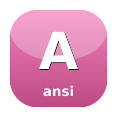 | **[CandyAnsi](candy-ansi/)** | ECMA-48 VT500 state machine — ANSI byte-stream parser with abstract Handler interface. Extraction from candy-vt. |
| 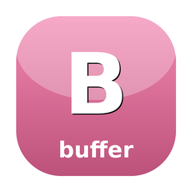 | **[CandyBuffer](candy-buffer/)** | Cell-grid value objects — immutable Buffer (2-D cell grid) and Cell (`rune`/style/link/width). Shared foundation for all rendering; `Buffer::diff()` included. |
|  | **[CandyLayout](candy-layout/)** | Constraint-based layout solver — `LayoutSolver` interface with a Cassowary engine (`CassowarySolver`) and a `GreedySolver` fallback. |
| 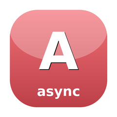 | **[CandyAsync](candy-async/)** | Shared async vocabulary for ReactPHP — CancellationToken, Subscriptions, AsyncOps helpers (withTimeout, retry, debounce, throttle). |
| 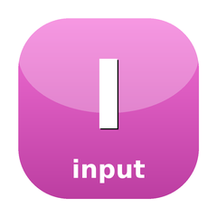 | **[CandyInput](candy-input/)** | Terminal input decoder — raw TTY bytes to typed events: keyboard (Kitty progressive protocol, xterm modifyOtherKeys, legacy encodings) and mouse (SGR, urxvt, X10) via `InputDriver` / `EscapeDecoder`. |
| 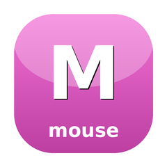 | **[CandyMouse](candy-mouse/)** | Mouse hit-testing — mark rendered regions, scan an event, get the zone back; `ZoneClickTracker` for press/release dedupe. Owned per consumer, no global manager — the self-contained successor to CandyZone's external-`Manager` model. |
|  | **[CandySprinkles](candy-sprinkles/)** | Declarative styling + layout — `Style`, `Border`, `Table`, `List`, `Tree`, `Layout::join`, `Place`, `Canvas` (multi-layer compositor). |
|  | **[CandyTesting](candy-testing/)** | Test harness for SugarCraft apps — ProgramSimulator, golden-file assertions, snapshot helpers. |
|  | **[HoneyBounce](honey-bounce/)** | Damped spring physics + Newtonian projectile simulation. |
|  | **[CandyZone](candy-zone/)** | Mouse-zone tracker — wrap rendered chunks, get back bounding boxes. |
| 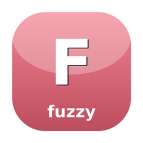 | **[CandyFuzzy](candy-fuzzy/)** | Fuzzy string matching with scored match indices — powers filter-as-you-type highlighting across the ecosystem. |
|  | **[SugarBits](sugar-bits/)** | Components: TextInput, TextArea, ItemList, Table, Tabs, Tree, Scrollbar, Viewport, FilePicker, Progress, Spinner, Cursor, Help, Key, Paginator, Stopwatch, Timer. |
| 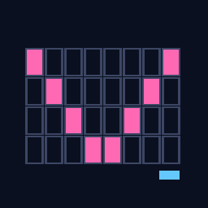 | **[CandyVt](candy-vt/)** | Virtual terminal emulator — ANSI byte stream → cell grid + cursor + mode state. |
| 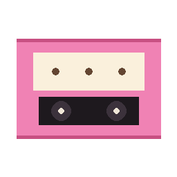 | **[CandyVcr](candy-vcr/)** | Record + replay candy-core sessions — JSONL/YAML cassettes, `Program::withRecorder()`, `Player` with byte + cell-grid assertions, CLI. |
| 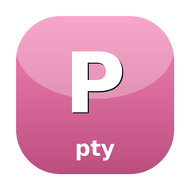 | **[CandyPty](candy-pty/)** | Pseudo-terminal primitive — `Pty::open()` master/slave round-trip via FFI to libc; spawn/resize/non-blocking I/O. Linux + macOS only. |
| 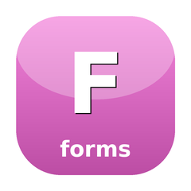 | **[CandyForms](candy-forms/)** | Foundation lib for form primitives — TextInput, TextArea, ItemList, Viewport, FilePicker, Field interface, Confirm, Form (the shared form engine behind SugarBits and SugarPrompt). |
|  | **[CandyFocus](candy-focus/)** | Focus-ring state machine — ordered focusable regions with Tab/Shift-Tab traversal. |
|  | **[SugarGallery](sugar-gallery/)** | Poster grids & rails for media TUIs — virtualized PosterGrid, Rail carousel, PosterCard. |
|  | **[SugarCharts](sugar-charts/)** | Canvas + Sparkline, Bar, Line, Heatmap, Scatter, TimeSeries, Streamline, Waveline, OHLC, Picture (Sixel/Kitty/iTerm2). |
| 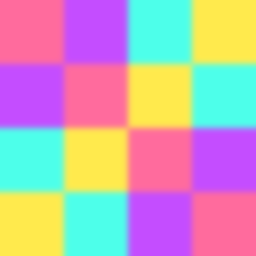 | **[CandyMosaic](candy-mosaic/)** | Image-to-cell renderer — PNG/JPEG/static GIF decoded via ext-gd, drawn with the best available protocol (Kitty, iTerm2, Sixel; an ANSI half-block fallback is always available). |
|  | **[SugarPrompt](sugar-prompt/)** | Form library — Note, Input, Confirm, Select, MultiSelect, Text, FilePicker; multi-page Groups; 7 stock themes. |
|  | **[CandyShine](candy-shine/)** | Markdown → ANSI renderer with word-wrap, OSC 8 hyperlinks, 9 built-in themes. |
|  | **[CandyKit](candy-kit/)** | CLI presentation helpers — StatusLine, Banner, Section, Stage, HelpText. |
|  | **[CandyWish](candy-wish/)** | SSH server middleware — Logger, Auth, RateLimit, and the `BubbleTea` middleware that mounts a SugarCraft Program over `ForceCommand` (HostSshd transport). |
|  | **[CandyMetrics](candy-metrics/)** | Telemetry primitives — counters, gauges, histograms with InMemory / JSON / StatsD / Prometheus textfile / Multi backends, plus a CandyWish session middleware. |
|  | **[CandyLog](candy-log/)** | Colorful leveled logger — Debug / Info / Warn / Error / Fatal with structured context, Text / JSON / Logfmt formatters, sub-loggers, and StandardLogAdapter. |
| 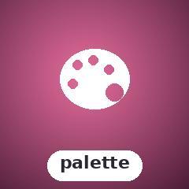 | **[CandyPalette](candy-palette/)** | Terminal color profile detection + ANSI / ANSI256 / TrueColor conversion. StandardColors and ProfileWriter. |
|  | **[CandyLister](candy-lister/)** | Tree/list view with box-drawing prefixes, cursor navigation, word-wrap, and filter-as-you-type. |
| 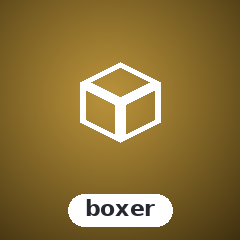 | **[SugarBoxer](sugar-boxer/)** | Box-drawing layout engine — H/V panel composition with weighted sizing, borders, and nested grids. |
| 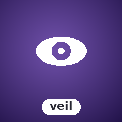 | **[SugarVeil](sugar-veil/)** | Terminal overlay compositor — push/pop overlay views with z-ordering, positioning, and per-overlay teardown. |
| 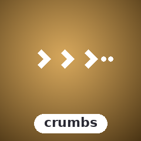 | **[SugarCrumbs](sugar-crumbs/)** | Navigation breadcrumbs — immutable NavStack with push/pop, shell-change detection, and type-ahead filter. |
| 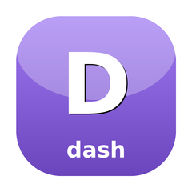 | **[SugarDash](sugar-dash/)** | Dashboard TUI library — column grid layout, framed panels, status bar, tabs, and more. |
| 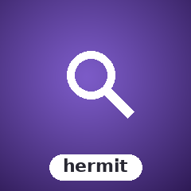 | **[CandyHermit](candy-hermit/)** | Fuzzy finder overlay — type to filter a list, arrow keys to select, Enter to confirm; wraps any Model. |
|  | **[SugarStickers](sugar-stickers/)** | FlexBox layout engine + simple sort/filter table. Ratio-based sizing, gap, justify, align, per-column styling. |
| 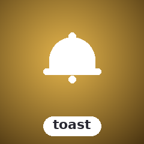 | **[SugarToast](sugar-toast/)** | Floating notification overlays — Info / Success / Warning / Error types, configurable position and auto-dismiss. |
|  | **[SugarCalendar](sugar-calendar/)** | Interactive month-grid date picker — keyboard navigation, min/max date constraints, locale day names, ANSI rendering. |
| 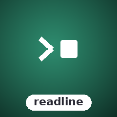 | **[SugarReadline](sugar-readline/)** | Interactive prompts — Text, Confirm, Selection, MultiSelect, Textarea. State-machine model, no external readline dependency. |
|  | **[SugarTable](sugar-table/)** | Full-featured interactive data table — column definitions, StyledCell ANSI formatting, pagination, frozen rows/cols. |
|  | **[SugarDiff](sugar-diff/)** | Unified-diff engine — LCS line diff, `diff -u` hunks, writer + line-number scanner. Extracted from sugar-crush. |
|  | **[SugarMcp](sugar-mcp/)** | Model Context Protocol (MCP) client core — JSON-RPC 2.0 codec, stdio transport with bounded child lifecycle, initialize/tools handshake, tool narrowing. Extracted from sugar-crush. |

## Apps built on the stack

| | App | Role |
|---|---|---|
|  | **[CandyMold](candy-mold/)** | `composer create-project sugarcraft/candy-mold my-app` — bootstrap skeleton with a working counter Model. |
|  | **[CandyShell](candy-shell/)** | Composer-installable CLI of 13 presentation subcommands (choose, confirm, file, filter, format, input, join, log, pager, spin, style, table, write) — scriptable terminal UI in one-liners. |
|  | **[CandyFreeze](candy-freeze/)** | Code → SVG screenshot generator (no `ext-gd` required). |
|  | **[SugarGlow](sugar-glow/)** | Markdown CLI viewer / pager. |
|  | **[SugarSpark](sugar-spark/)** | ANSI escape-sequence inspector. |
|  | **[SugarWishlist](sugar-wishlist/)** | TUI directory of SSH endpoints — YAML/JSON config + `pcntl_exec` into the chosen `ssh`. |
| 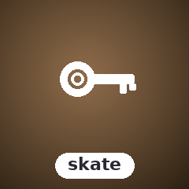 | **[SugarSkate](sugar-skate/)** | Personal key/value store — one SQLite database per store, `@dbname` namespaces, glob listing, TTL, binary values, JSON/YAML import/export. |
|  | **[SugarPost](sugar-post/)** | Email sending library — SMTP + Resend API transports, attachments, HTML + plain-text multipart, fluent interface. |
| 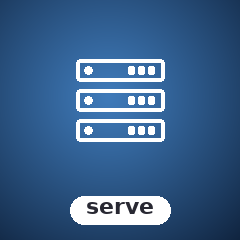 | **[CandyServe](candy-serve/)** | Self-hostable Git server over SSH (authorized keys), Git daemon, and HTTP. Users, repos, access control, optional LFS. |
|  | **[CandyTetris](candy-tetris/)** | Tetris clone — SRS rules, 7-bag, ghost piece, NES scoring, level-driven gravity. |
| 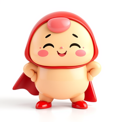 | **[CandyFiles](candy-files/)** | Dual-pane file manager — Midnight Commander style, multi-select, sort, delete-with-confirm. |
|  | **[SugarCrush](sugar-crush/)** | AI coding-assistant chat shell — direct multi-provider engine (OpenAI / Anthropic-compatible / SGLang / Bedrock / Vertex), shell-out command backends, and an offline EchoBackend. |
|  | **[SugarCrushWeb](sugar-crush-web/)** | Browser UI for SugarCrush's server mode — Vite + Vue 3 bundle committed as `dist/`, located by a one-class PHP shim so `sugarcrush serve` needs no Node. MVP: one session with live tool cards, diffs and approvals. |
|  | **[SugarStash](sugar-stash/)** | Three-pane git TUI — status / branches / log, single-key stage / unstage; shells out to `git` for every mutation. |
|  | **[CandyQuery](candy-query/)** | Terminal SQL browser — SQLite, MySQL and PostgreSQL: schema browsing, row editing, ad-hoc queries, EXPLAIN plans (PDO + `:memory:` test fixtures). |
| 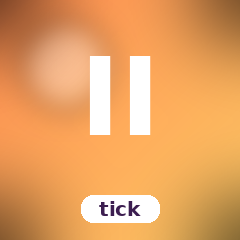 | **[SugarTick](sugar-tick/)** | Privacy-first coding-time tracker — JSONL on disk, SugarCharts-driven dashboard, no cloud. |
| 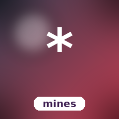 | **[CandyMines](candy-mines/)** | Minesweeper — first-click safety, recursive flood-fill, flag toggle, win/lose detection, deterministic-RNG injectable. |
|  | **[CandyFlip](candy-flip/)** | ASCII GIF viewer — ext-gd decode, downsample to a cell grid, render as ANSI 24-bit blocks or a luminance-ramp. |
|  | **[CandyTop](candy-top/)** | Terminal system monitor — live CPU, memory, network, disk, and process views built on sugar-charts, sugar-dash, and the candy-core runtime. |
|  | **[SugarReel](sugar-reel/)** | Terminal video player — pipes mp4 (and more) through `ffmpeg`/`ffprobe` on the fly and renders to ASCII / ANSI / truecolor half-block / sixel / kitty (GIF via ext-gd, no ffmpeg). |
| 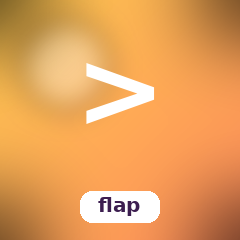 | **[HoneyFlap](honey-flap/)** | Flappy-Bird-style game — bird motion is a HoneyBounce projectile, pipes scroll left at a fixed cell rate. |

Each library has its own `README.md` with usage examples and a deep dive into
its public API.

## Quickstart — a counter app

Save as `counter.php` in a project with `composer require sugarcraft/candy-core`,
then run `php counter.php`:

```php
use SugarCraft\Core\{Cmd, KeyType, Model, Msg, Program, Subscriptions};
use SugarCraft\Core\Msg\KeyMsg;

final class Counter implements Model
{
    public function __construct(public readonly int $n = 0) {}
    public function init(): ?\Closure { return null; }

    public function update(Msg $msg): array
    {
        if ($msg instanceof KeyMsg && $msg->type === KeyType::Char && $msg->rune === 'q') {
            return [$this, Cmd::quit()];
        }
        return [
            $msg instanceof KeyMsg && $msg->type === KeyType::Up
                ? new self($this->n + 1)
                : ($msg instanceof KeyMsg && $msg->type === KeyType::Down
                    ? new self($this->n - 1)
                    : $this),
            null,
        ];
    }

    public function view(): string { return "n = {$this->n}\n↑ ↓ to count, q to quit\n"; }

    public function subscriptions(): ?Subscriptions { return null; }
}

(new Program(new Counter()))->run();
```

## Architecture

- **PHP 8.3+** — fibers, readonly props, enums, `match`, intersection types.
- **Runtime**: ReactPHP event loop — input, signals, render tick, and command
  execution all run concurrently on a single loop.
- **Style**: PSR-12 + readonly DTOs. Every `Style`, `Model`, etc. is
  immutable — `with*()` returns a new instance.
- **Testing**: PHPUnit 10. Snapshot ANSI tests for renderers; scripted-input
  event tests for the runtime.
- **Layout**: monorepo; every library also publishes as a standalone package
  and will later split into its own repo.

## Status

Every library in the table above ships at **v1**, each with its own composer
package and PHPUnit suite, and CI publishes per-library coverage to Codecov;
the rendering libraries pin their output with snapshot-ANSI tests. The
[website](https://sugarcraft.github.io/) library matrix carries live
per-package status, and each library's `README.md` documents its full public
API.

## Adding a new library or app

The full package roster lives in
[MATCHUPS.md](./docs/MATCHUPS.md), and the contributor / agent playbook in
[AGENTS.md](./AGENTS.md) walks through the complete integration checklist:
naming conventions, package skeleton, tests, examples, VHS demos (terminal
sessions recorded as GIFs), website tiles, and the central docs to update.
AI assistants should read AGENTS.md first.

## Running the test suites

The umbrella package is a metapackage; each library has its own
`composer.json` + `vendor/`. To test everything:

```sh
for d in candy-* sugar-* honey-*; do
    [ -f "$d/phpunit.xml" ] || continue
    (cd "$d" && composer install --quiet && vendor/bin/phpunit) || exit 1
done
```

Code style is enforced via `php-cs-fixer` (root `.php-cs-fixer.dist.php`). Run from the repo root:

```sh
PHP_CS_FIXER_IGNORE_ENV=1 php-cs-fixer fix --diff --allow-risky=yes
```

## Contributing

See [CONTRIBUTING.md](./CONTRIBUTING.md). Bugs, feature requests,
and new libraries — original tools, components, and terminal apps that
fill gaps in the PHP stack — are all welcome.
For security issues, see [SECURITY.md](./SECURITY.md).

## License

[MIT](./LICENSE).

## Credits & inspiration

SugarCraft is a PHP-native project. Its original design inspiration came
from the Go terminal ecosystem — notably
[Bubble Tea](https://github.com/charmbracelet/bubbletea) and the wider
[Charm](https://github.com/charmbracelet) family of libraries — reimagined
here for PHP 8.3+.

---

<p align="center">
  <a href="https://sugarcraft.github.io/"></a><br>
  <em>made with sugar · sweet to build · fun to use</em>
</p>
